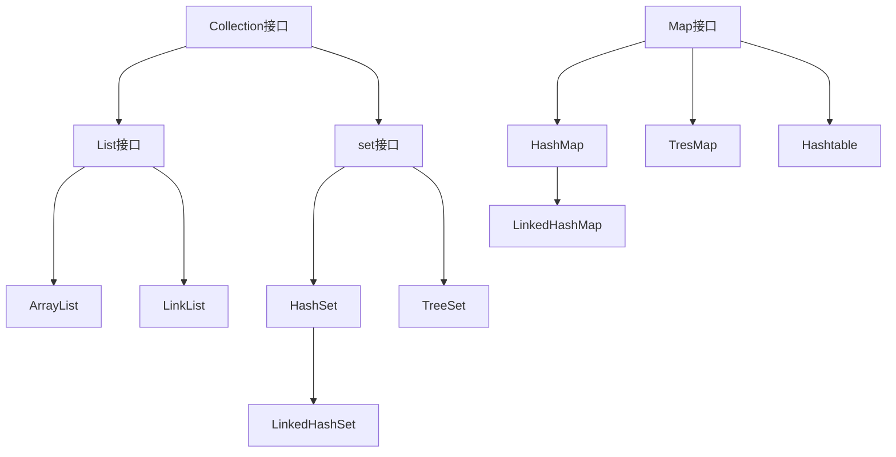

[[TOC]]

## 为什么使用集合框架？

假设，一个班级有 30 个人，我们需要存储学员的信息，是不是我们可以用一个一维数组就解决了？

那换一个问题，一个网站每天要存储的新闻信息，我们知道新闻是可以实时发布的，我们并不知道需要多大的空间去存储，我要是去设置一个很大的数组，要是没有存满，或者不够用，都会影响我们，前者浪费的空间，后者影响了业务。

如果并不知道程序运行时会需要多少对象，或者需要更复杂的方式存储对象，那我们就可以使用 Java 的集合框架。

## 集合框架包含的内容

Java 集合框架提供了一套性能优良，使用方便的接口和类，他们位于 java.util 包中。

接口和具体类

图片：

算法

Collections 类提供了对集合进行排序，遍历等多种算法实现。

重中之重：

- Collection 接口存储一组不唯一，无序的对象

- List 接口存储一组不唯一，有序的对象

- Set 接口存储一组唯一，无序的对象

- Map 接口存储一组键值对象，提供 key 到 value 的映射

- ArrayList 实现了长度可变的数组，在内存中分配连续的空间。遍历元素和随机访问元素的效率比较高

  
  
  
- LinkedList 采用链表存储方式。插入、删除元素时效率比较高

  

- HashSet 采用哈希算法实现的 Set，HashSet 的底层是用 HashMap 实现的，因此查询效率较高，由于采用 hashCode 算法直接确定元素的内存地址，增删效率也挺高的

  